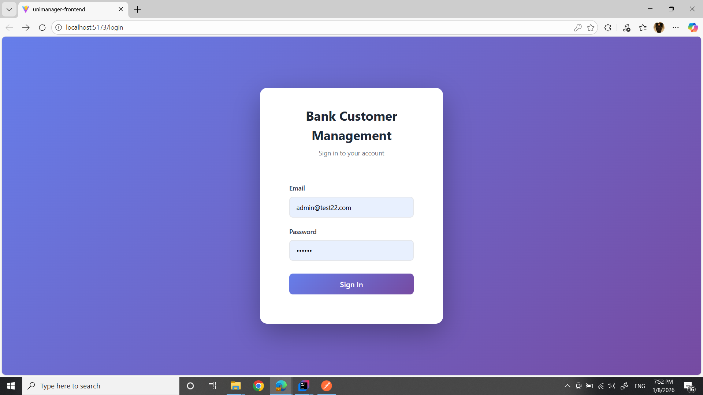
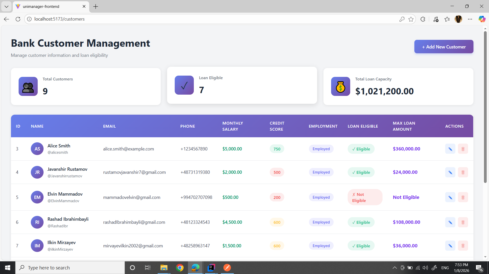
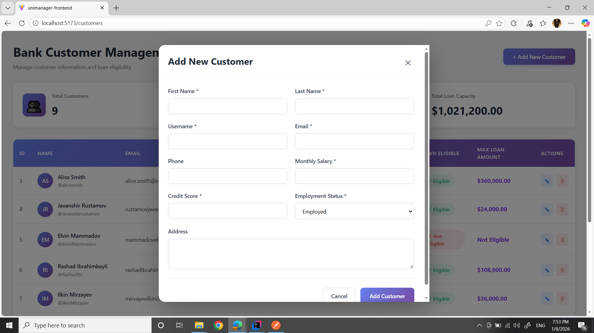

# 🏦 Bank Customer Management System

A full-stack web application for managing bank customers and calculating loan eligibility based on credit scores, employment status, and monthly salary.

    

---

## 📋 Table of Contents

- [Features](#features)
- [Tech Stack](#tech-stack)
- [Screenshots](#screenshots)
- [Getting Started](#getting-started)
- [API Endpoints](#api-endpoints)
- [Security](#security)
- [Contact](#contact)

---

## ✨ Features

### Customer Management
- ✅ Add, Edit, and Delete customer records
- ✅ View all customers in an interactive table
- ✅ Search and filter customers
- ✅ Real-time loan eligibility calculation

### Loan Eligibility System
- 💰 Automatic calculation based on:
  - Credit Score (300-850)
  - Monthly Salary
  - Employment Status
- 📊 Maximum loan amount determination
- 🎯 Clear eligibility status indicators

### Security
- 🔐 JWT (JSON Web Token) authentication
- 🔒 BCrypt password encryption
- 🛡️ Protected API endpoints
- 👤 User registration and login

### User Interface
- 📱 Responsive design
- 🎨 Modern, clean interface
- 📈 Dashboard with summary statistics
- ⚡ Fast and intuitive user experience

---

## 🛠️ Tech Stack

### Backend
- **Java 17**
- **Spring Boot 3.x**
- **Spring Security** - JWT authentication
- **Spring Data JPA** - Database operations
- **PostgreSQL** - Relational database
- **Maven** - Dependency management
- **Lombok** - Reduce boilerplate code

### Frontend
- **React 18**
- **Axios** - HTTP client
- **React Router** - Navigation
- **CSS3** - Modern styling
- **Vite** - Build tool

### Security
- **JWT (JSON Web Tokens)**
- **BCrypt** - Password hashing
- **CORS** - Cross-Origin Resource Sharing

---

## 📸 Screenshots

### Login Page


### Dashboard


### Add Customer Form


---

## 🚀 Getting Started

### Prerequisites
- Java 17 or higher
- Node.js 16+ and npm
- PostgreSQL 12+
- Git

### Backend Setup

1. **Clone the repository**
```bash
   git clone https://github.com/javanshir21/BankCustomerManagement.git
   cd BankCustomerManagement/unimanage-backend1
```

2. **Create PostgreSQL Database**
```sql
   CREATE DATABASE bank_db;
```

3. **Configure Database**
   
   Update `src/main/resources/application.properties`:
```properties
   spring.datasource.url=jdbc:postgresql://localhost:5432/bank_db
   spring.datasource.username=your_postgres_username
   spring.datasource.password=your_postgres_password
   spring.jpa.hibernate.ddl-auto=update
   spring.jpa.show-sql=true
```

4. **Build and Run**
```bash
   mvn clean install
   mvn spring-boot:run
```

   Backend will run on: `http://localhost:8089`

### Frontend Setup

1. **Navigate to frontend**
```bash
   cd ../frontend
```

2. **Install dependencies**
```bash
   npm install
```

3. **Verify API endpoint**
   
   Check `src/api/api.js` - baseURL should be:
```javascript
   baseURL: 'http://localhost:8089'
```

4. **Start development server**
```bash
   npm run dev
```

   Frontend will run on: `http://localhost:5173`

5. **Access the application**
   
   Open your browser: `http://localhost:5173`

---

## 📡 API Endpoints

### Authentication
| Method | Endpoint | Description | Auth Required |
|--------|----------|-------------|---------------|
| POST | `/api/auth/register` | Register new user | ❌ |
| POST | `/api/auth/login` | Login user | ❌ |

### Customer Management
| Method | Endpoint | Description | Auth Required |
|--------|----------|-------------|---------------|
| GET | `/customer` | Get all customers | ✅ |
| POST | `/customer` | Create customer | ✅ |
| PUT | `/customer/{id}` | Update customer | ✅ |
| DELETE | `/customer/{id}` | Delete customer | ✅ |

### Example Requests

**Register:**
```json
POST /api/auth/register
Content-Type: application/json

{
  "email": "admin@example.com",
  "password": "securePassword123"
}
```

**Login:**
```json
POST /api/auth/login
Content-Type: application/json

{
  "email": "admin@example.com",
  "password": "securePassword123"
}
```

**Response:**
```json
{
  "token": "eyJhbGciOiJIUzI1NiIsInR5cCI6IkpXVCJ9..."
}
```

**Get Customers:**
```bash
GET /customer
Authorization: Bearer {your-jwt-token}
```

**Create Customer:**
```json
POST /customer
Authorization: Bearer {your-jwt-token}
Content-Type: application/json

{
  "name": "John",
  "surname": "Doe",
  "username": "johndoe",
  "email": "john.doe@example.com",
  "phone": "+1234567890",
  "address": "123 Main St, City",
  "monthlySalary": 5000.00,
  "creditScore": 750,
  "employmentStatus": "Employed"
}
```

---

## 🔐 Security

### JWT Authentication Flow

1. User registers/logs in with credentials
2. Server validates and returns JWT token
3. Client stores token in localStorage
4. Token included in Authorization header for protected routes:
```
   Authorization: Bearer {token}
```
5. Server validates token on each request
6. Token expires after 24 hours

### Password Security
- Passwords hashed with BCrypt (strength: 10)
- Never stored in plain text
- Secure password validation on server-side

### CORS Configuration
- Configured for local development (ports 3000, 4200, 5173, 8081)
- Credentials allowed for authentication
- Proper headers configuration

---

## 🎯 Loan Eligibility Logic

The system automatically calculates loan eligibility based on these criteria:
```javascript
IF credit_score >= 700 AND employment_status == "Employed":
    max_loan = monthly_salary × 12 × 6  // 6x annual salary
    eligible = TRUE

ELSE IF credit_score >= 650 AND monthly_salary >= 3000:
    max_loan = monthly_salary × 12 × 4  // 4x annual salary
    eligible = TRUE

ELSE IF credit_score >= 600 AND employment_status == "Employed":
    max_loan = monthly_salary × 12 × 2  // 2x annual salary
    eligible = TRUE

ELSE:
    max_loan = 0
    eligible = FALSE
```

---

## 📊 Project Structure
```
BankCustomerManagement/
├── unimanage-backend1/              # Spring Boot Backend
│   ├── src/
│   │   ├── main/
│   │   │   ├── java/
│   │   │   │   └── com/users/customermanagement/
│   │   │   │       ├── controller/
│   │   │   │       │   └── auth/
│   │   │   │       │       ├── AuthController.java
│   │   │   │       │       └── LoginRequest.java
│   │   │   │       ├── model/
│   │   │   │       │   ├── Customer.java
│   │   │   │       │   └── User.java
│   │   │   │       ├── repository/
│   │   │   │       │   ├── CustomerRepository.java
│   │   │   │       │   └── UserRepository.java
│   │   │   │       ├── security/
│   │   │   │       │   ├── JwtAuthFilter.java
│   │   │   │       │   ├── JwtService.java
│   │   │   │       │   ├── SecurityConfig.java
│   │   │   │       │   ├── CustomUserDetails.java
│   │   │   │       │   └── CustomUserDetailsService.java
│   │   │   │       └── service/
│   │   │   │           ├── CustomerService.java
│   │   │   │           └── UserService.java
│   │   │   └── resources/
│   │   │       └── application.properties
│   └── pom.xml
│
├── frontend/                         # React Frontend
│   ├── src/
│   │   ├── api/
│   │   │   └── api.js
│   │   ├── pages/
│   │   │   ├── Customers.jsx
│   │   │   └── Login.jsx
│   │   ├── styles/
│   │   │   ├── Customers.css
│   │   │   └── Login.css
│   │   ├── App.jsx
│   │   └── main.jsx
│   ├── package.json
│   └── vite.config.js
│
├── login.png
├── dashboard.png
├── add-customer.png
└── README.md
```

---

## 🐛 Troubleshooting

### Common Issues

**Backend won't start:**
- Check if PostgreSQL is running
- Verify database credentials in `application.properties`
- Ensure port 8089 is not in use
- Create database: `CREATE DATABASE bank_db;`

**Frontend can't connect to backend:**
- Verify backend is running on port 8089
- Check CORS configuration
- Clear browser cache and localStorage

**401 Unauthorized errors:**
- Check if token is stored in localStorage
- Verify token hasn't expired (24-hour expiration)
- Try logging in again

**Database connection errors:**
- Verify PostgreSQL service is running
- Check username/password in application.properties
- Ensure database `bank_db` exists

---

## 🚀 Future Enhancements

- [ ] Add pagination for customer list
- [ ] Implement advanced search and filtering
- [ ] Customer transaction history
- [ ] Generate PDF reports
- [ ] Email notifications for loan approvals
- [ ] Multi-language support
- [ ] Dark mode theme
- [ ] Export data to CSV/Excel
- [ ] Role-based access control (Admin/User)
- [ ] Audit logging system

---

## 🤝 Contributing

Contributions are welcome! Please feel free to submit a Pull Request.

1. Fork the project
2. Create your feature branch (`git checkout -b feature/AmazingFeature`)
3. Commit your changes (`git commit -m 'Add some AmazingFeature'`)
4. Push to the branch (`git push origin feature/AmazingFeature`)
5. Open a Pull Request

---

## 📧 Contact

**Javanshir Rustamov**
- GitHub: [@javanshir21](https://github.com/javanshir21)
- LinkedIn: [Javanshir Rustamov](https://www.linkedin.com/in/javanshir-rustamov/)
- Email: rustamovjavanshir7@gmail.com
- Project Link: [https://github.com/javanshir21/BankCustomerManagement](https://github.com/javanshir21/BankCustomerManagement)

---

## 📝 License

This project is open source and available under the [MIT License](LICENSE).

---

## 🙏 Acknowledgments

- [Spring Boot Documentation](https://spring.io/projects/spring-boot)
- [React Documentation](https://react.dev/)
- [PostgreSQL Documentation](https://www.postgresql.org/docs/)
- [JWT.io](https://jwt.io/) - Token debugging
- [Stack Overflow Community](https://stackoverflow.com/)

---

## 📈 Project Stats


---

**⭐ If you found this project helpful, please give it a star!**

---

*Built with ❤️ by Javanshir Rustamov - IT Business Analyst*

*"Bridging business requirements with technical implementation through hands-on development"*
